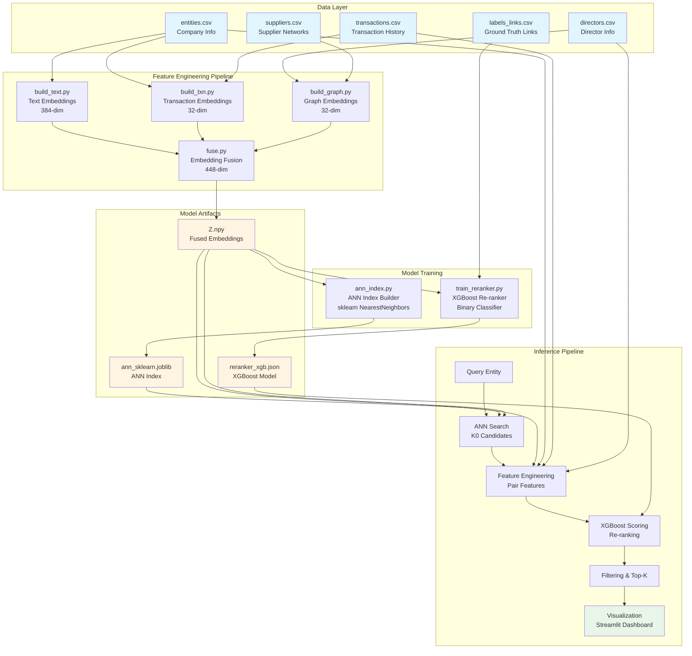
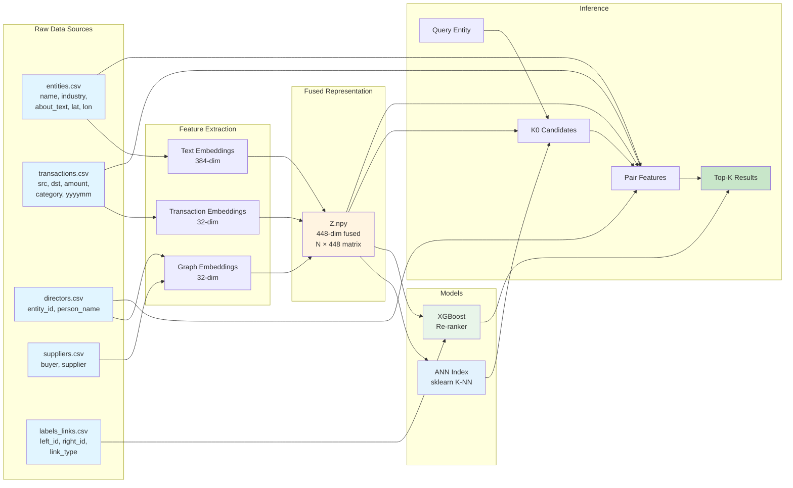
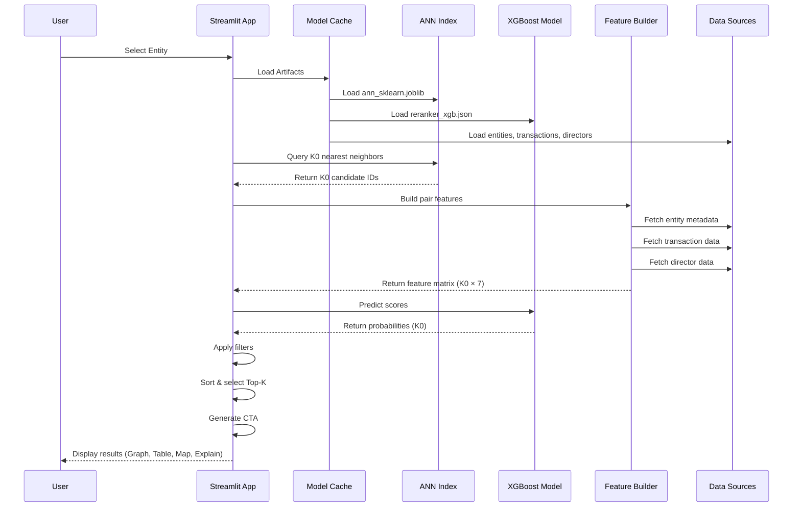

# Proximity Finder - Architecture Diagrams

This document contains high-level architecture, tech stack, and flow diagrams for the Proximity Finder system.

---

## 1. High-Level Architecture



---

## 2. Tech Stack

```mermaid
graph LR
    subgraph "Data Processing"
        P1[Pandas<br/>DataFrames]
        P2[NumPy<br/>Arrays]
        P3[PyYAML<br/>Config]
    end

    subgraph "Embedding Models"
        E1[Sentence-Transformers<br/>all-MiniLM-L6-v2<br/>384-dim]
        E2[PCA<br/>Dimensionality Reduction]
        E3[NetworkX<br/>Graph Processing]
    end

    subgraph "ML Models"
        M1[scikit-learn<br/>NearestNeighbors<br/>Cosine Similarity]
        M2[XGBoost<br/>Gradient Boosting<br/>Binary Classifier]
    end

    subgraph "Storage"
        S1[CSV Files<br/>Raw Data]
        S2[NumPy Arrays<br/>.npy Files]
        S3[Joblib<br/>.joblib Files]
        S4[JSON<br/>Model & Config]
        S5[Parquet<br/>Feature Tables]
    end

    subgraph "Application"
        A1[Streamlit<br/>Web Dashboard]
        A2[Cytoscape.js<br/>Graph Visualization]
        A3[PyDeck<br/>Map Visualization]
    end

    subgraph "Evaluation"
        EV1[Precision@K]
        EV2[Recall@K]
        EV3[AUCPR]
    end

    P1 --> E1
    P1 --> E2
    P1 --> E3
    P2 --> M1
    P2 --> M2

    E1 --> S2
    E2 --> S2
    E3 --> S2
    M1 --> S3
    M2 --> S4

    S1 --> P1
    S2 --> M1
    S2 --> M2
    S3 --> A1
    S4 --> A1

    A1 --> A2
    A1 --> A3

    M2 --> EV1
    M2 --> EV2
    M2 --> EV3

    style E1 fill:#ffebee
    style M1 fill:#e3f2fd
    style M2 fill:#e8f5e9
    style A1 fill:#fff3e0
```

---

## 3. Training Flow


---

## 4. Inference Flow

```mermaid
flowchart TD
    START([User Query<br/>Select Entity]) --> LOAD[Load Artifacts<br/>- Z.npy embeddings<br/>- ann_sklearn.joblib<br/>- reranker_xgb.json<br/>- entities.csv<br/>- transactions.csv<br/>- directors.csv]

    LOAD --> QUERY[Get Query Entity<br/>entity_id → index]

    QUERY --> ANN[Stage 1: ANN Search<br/>K0 Candidates]
    ANN --> ANN_PROC[Process:<br/>- Extract query embedding Z[query_idx]<br/>- index.kneighbors query<br/>- Cosine similarity search<br/>- Return K0 nearest neighbors<br/>Default: K0=400]
    ANN_PROC --> CAND[Output: K0 candidate IDs<br/>e.g., 400 entities]

    CAND --> FEAT[Stage 2: Feature Engineering<br/>For each candidate pair]
    FEAT --> FEAT_PROC[Compute Pair Features:<br/>1. cos_sim = cosine Z[query], Z[cand]<br/>2. jacc_ctp = Jaccard counterparties<br/>3. geo_km = Haversine distance<br/>4. ind_match = industry match<br/>5. dir_overlap = shared directors<br/>6. diff_mean = mean|Z_q - Z_c|<br/>7. had_mean = mean Z_q * Z_c]
    FEAT_PROC --> FEAT_MAT[Output: Feature Matrix X<br/>Shape: K0 × 7 features]

    FEAT_MAT --> SCORE[Stage 3: XGBoost Re-ranking]
    SCORE --> SCORE_PROC[Process:<br/>- Create DMatrix from X<br/>- reranker.predict DMatrix<br/>- Get probability scores [0,1]]
    SCORE_PROC --> SCORES[Output: Scores array<br/>Shape: K0 probabilities]

    SCORES --> FILTER[Stage 4: Filtering]
    FILTER --> FILTER_PROC[Apply Filters:<br/>- min_score threshold<br/>- max_geo distance<br/>- customers_only flag<br/>- same_industry flag<br/>- shared_directors flag<br/>- nearby_only flag]
    FILTER_PROC --> FILTERED[Filtered Candidates]

    FILTERED --> TOPK[Stage 5: Top-K Selection]
    TOPK --> TOPK_PROC[Process:<br/>- Sort by score descending<br/>- Take top K entities<br/>Default: K=20]
    TOPK_PROC --> RESULTS[Output: Top-K Neighbors<br/>with scores & metadata]

    RESULTS --> CTA[Stage 6: CTA Generation]
    CTA --> CTA_PROC[Compute Call-to-Action:<br/>- score ≥ 0.70 → Upsell/Prospect outreach<br/>- director_overlap > 0 or jaccard ≥ 0.30 → Warm intro<br/>- geo_km ≤ 250 and similarity ≥ 0.50 → Local lead<br/>- else → Research]
    CTA_PROC --> FINAL[Final Results with CTA]

    FINAL --> VIZ[Stage 7: Visualization]
    VIZ --> VIZ_NET[Network Graph<br/>Cytoscape.js<br/>- Nodes: entities<br/>- Edges: relationships<br/>- Colors: score tiers]
    VIZ --> VIZ_TAB[Data Table<br/>- Entity details<br/>- Feature values<br/>- Scores & CTA]
    VIZ --> VIZ_EXP[Explainability<br/>- Feature breakdown<br/>- Why selected<br/>- Recommendations]
    VIZ --> VIZ_MAP[Geographic Map<br/>PyDeck<br/>- Entity locations<br/>- Distance visualization]

    VIZ_NET --> END([Results Displayed])
    VIZ_TAB --> END
    VIZ_EXP --> END
    VIZ_MAP --> END

    style START fill:#c8e6c9
    style END fill:#c8e6c9
    style ANN fill:#fff9c4
    style FEAT fill:#ffccbc
    style SCORE fill:#b3e5fc
    style FILTER fill:#e1bee7
    style TOPK fill:#e1bee7
    style CTA fill:#f8bbd0
    style VIZ fill:#c5cae9
```

---

## 5. Data Flow Diagram



---

## 6. Component Interaction Diagram



---

## Summary

### Architecture Highlights

1. **Two-Stage Pipeline**: Fast ANN retrieval + accurate supervised re-ranking
2. **Multi-Modal Embeddings**: Text, transaction, and graph signals combined
3. **Feature-Rich Re-ranking**: 7 engineered features capture relationship signals
4. **Real-Time Inference**: Sub-second latency for interactive queries
5. **Explainable Results**: Feature-level explanations and CTA recommendations

### Key Technologies

- **Embeddings**: Sentence-Transformers (HuggingFace)
- **ANN Search**: scikit-learn NearestNeighbors
- **Re-ranking**: XGBoost Gradient Boosting
- **Visualization**: Streamlit + Cytoscape.js + PyDeck
- **Data Processing**: Pandas, NumPy, NetworkX

### Performance Characteristics

- **Training Time**: 5-10 min (10K entities), 30-45 min (100K entities)
- **Inference Time**: 70-160 ms per query
- **Scalability**: Handles 10K-100K entities efficiently
- **Accuracy**: Precision@20 ≈ 0.78, Recall@20 ≈ 0.45

