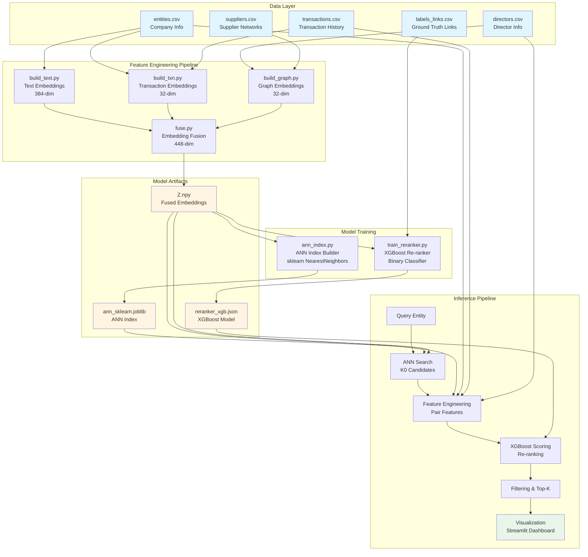
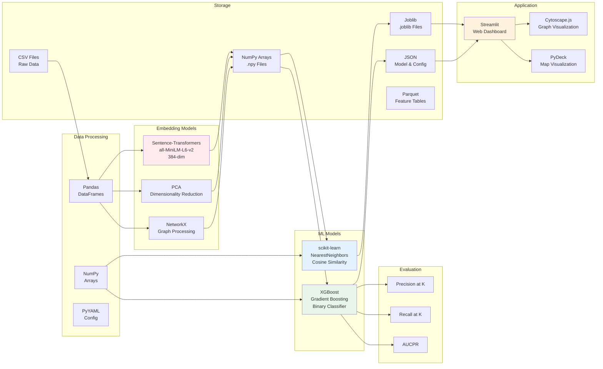
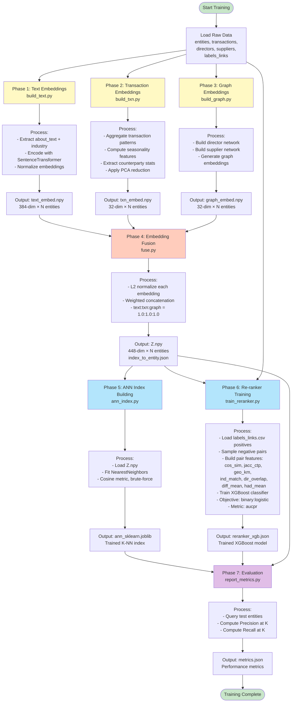
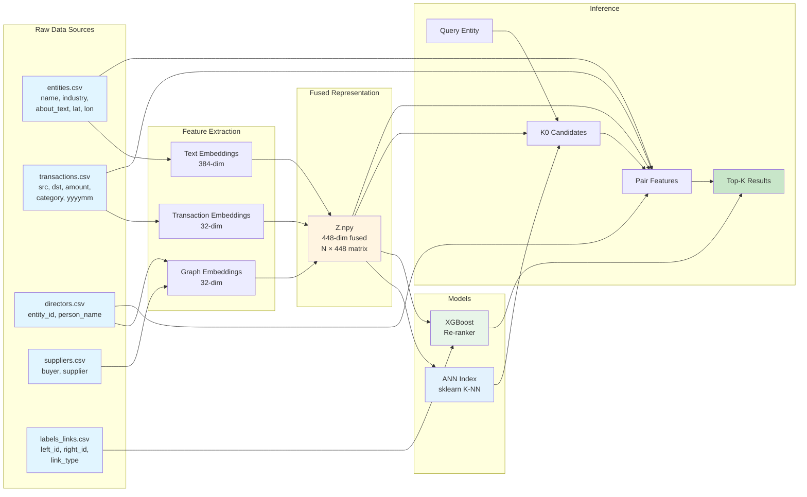
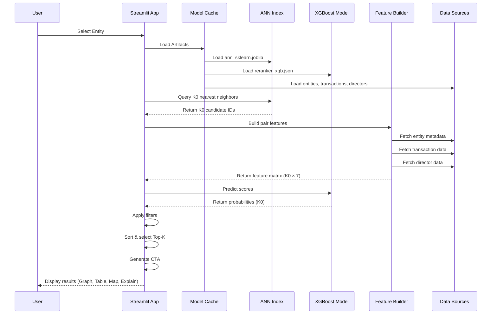
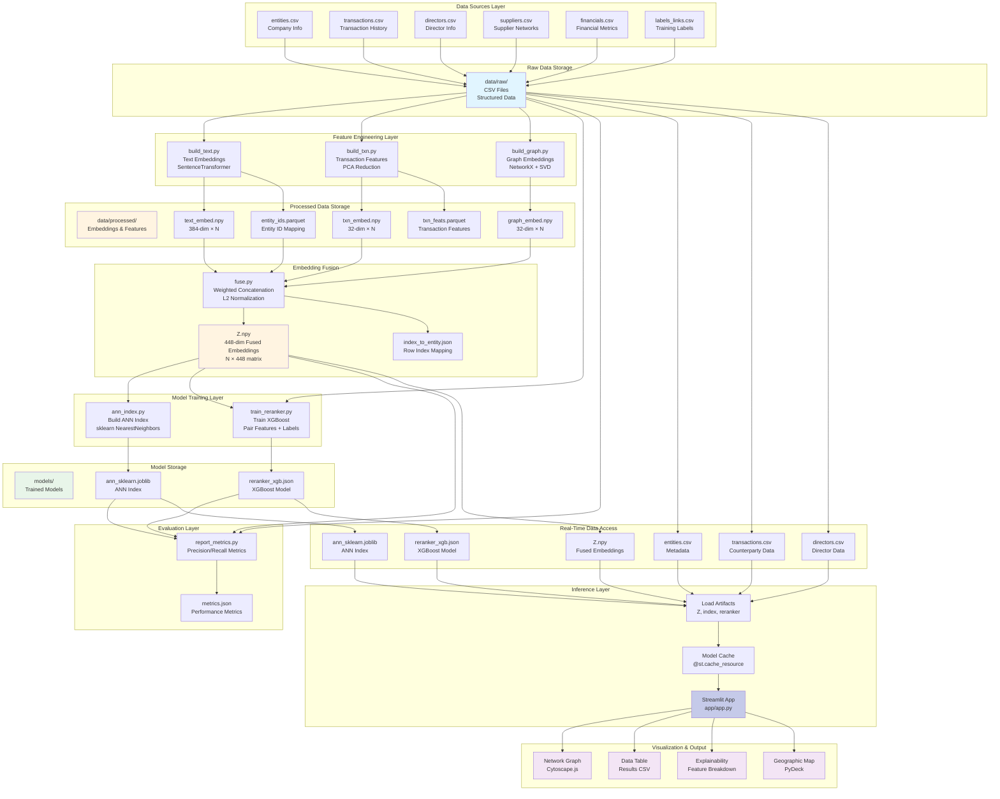
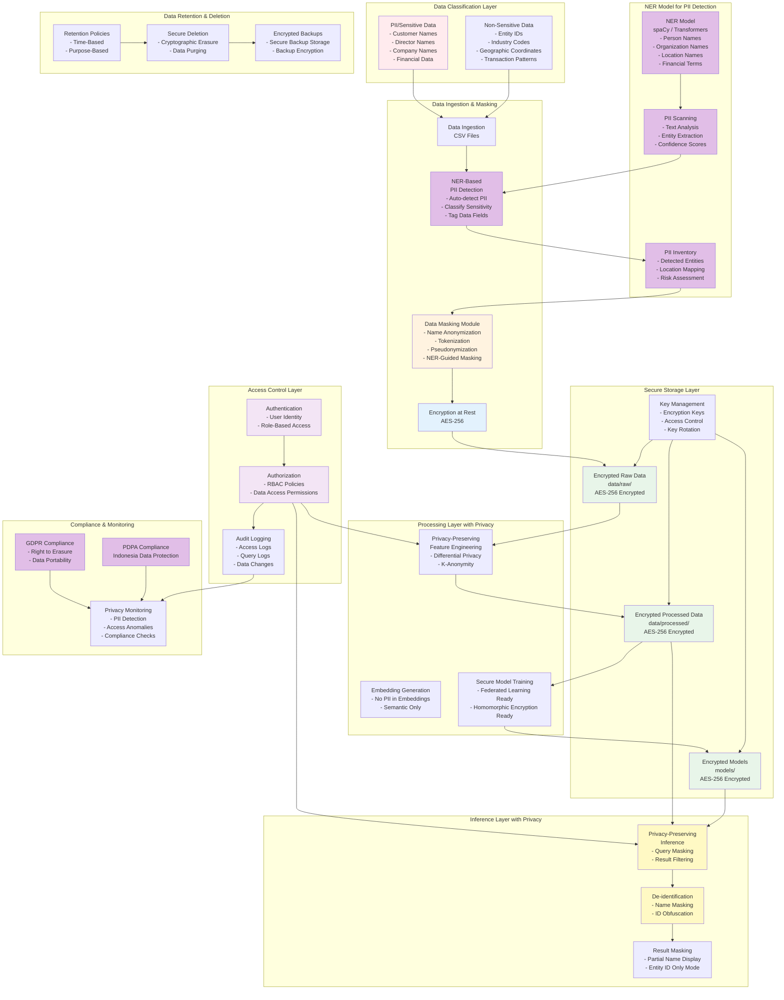

# Proximity Finder - Architecture Diagrams

This document contains high-level architecture, tech stack, and flow diagrams for the Proximity Finder system.

---

## 1. High-Level Architecture



---

## 2. Tech Stack



---

## 3. Training Flow



---

## 4. Inference Flow

```mermaid
flowchart TD
    START(["User Query<br/>Select Entity"]) --> LOAD["Load Artifacts<br/>- Z.npy embeddings<br/>- ann_sklearn.joblib<br/>- reranker_xgb.json<br/>- entities.csv<br/>- transactions.csv<br/>- directors.csv"]

    LOAD --> QUERY["Get Query Entity<br/>entity_id to index"]

    QUERY --> ANN["Stage 1: ANN Search<br/>K0 Candidates"]
    ANN --> ANN_PROC["Process:<br/>- Extract query embedding Z[query_idx]<br/>- index.kneighbors query<br/>- Cosine similarity search<br/>- Return K0 nearest neighbors<br/>Default: K0=400"]
    ANN_PROC --> CAND["Output: K0 candidate IDs<br/>e.g., 400 entities"]

    CAND --> FEAT["Stage 2: Feature Engineering<br/>For each candidate pair"]
    FEAT --> FEAT_PROC["Compute Pair Features:<br/>1. cos_sim = cosine Z[query], Z[cand]<br/>2. jacc_ctp = Jaccard counterparties<br/>3. geo_km = Haversine distance<br/>4. ind_match = industry match<br/>5. dir_overlap = shared directors<br/>6. diff_mean = mean abs Z_q - Z_c<br/>7. had_mean = mean Z_q * Z_c"]
    FEAT_PROC --> FEAT_MAT["Output: Feature Matrix X<br/>Shape: K0 x 7 features"]

    FEAT_MAT --> SCORE["Stage 3: XGBoost Re-ranking"]
    SCORE --> SCORE_PROC["Process:<br/>- Create DMatrix from X<br/>- reranker.predict DMatrix<br/>- Get probability scores 0-1"]
    SCORE_PROC --> SCORES["Output: Scores array<br/>Shape: K0 probabilities"]

    SCORES --> FILTER["Stage 4: Filtering"]
    FILTER --> FILTER_PROC["Apply Filters:<br/>- min_score threshold<br/>- max_geo distance<br/>- customers_only flag<br/>- same_industry flag<br/>- shared_directors flag<br/>- nearby_only flag"]
    FILTER_PROC --> FILTERED["Filtered Candidates"]

    FILTERED --> TOPK["Stage 5: Top-K Selection"]
    TOPK --> TOPK_PROC["Process:<br/>- Sort by score descending<br/>- Take top K entities<br/>Default: K=20"]
    TOPK_PROC --> RESULTS["Output: Top-K Neighbors<br/>with scores and metadata"]

    RESULTS --> CTA["Stage 6: CTA Generation"]
    CTA --> CTA_PROC["Compute Call-to-Action:<br/>- score >= 0.70: Upsell/Prospect outreach<br/>- director_overlap > 0 or jaccard >= 0.30: Warm intro<br/>- geo_km <= 250 and similarity >= 0.50: Local lead<br/>- else: Research"]
    CTA_PROC --> FINAL[Final Results with CTA]

    FINAL --> VIZ["Stage 7: Visualization"]
    VIZ --> VIZ_NET["Network Graph<br/>Cytoscape.js<br/>- Nodes: entities<br/>- Edges: relationships<br/>- Colors: score tiers"]
    VIZ --> VIZ_TAB["Data Table<br/>- Entity details<br/>- Feature values<br/>- Scores and CTA"]
    VIZ --> VIZ_EXP["Explainability<br/>- Feature breakdown<br/>- Why selected<br/>- Recommendations"]
    VIZ --> VIZ_MAP["Geographic Map<br/>PyDeck<br/>- Entity locations<br/>- Distance visualization"]

    VIZ_NET --> END(["Results Displayed"])
    VIZ_TAB --> END
    VIZ_EXP --> END
    VIZ_MAP --> END

    style START fill:#c8e6c9
    style END fill:#c8e6c9
    style ANN fill:#fff9c4
    style FEAT fill:#ffccbc
    style SCORE fill:#b3e5fc
    style FILTER fill:#e1bee7
    style TOPK fill:#e1bee7
    style CTA fill:#f8bbd0
    style VIZ fill:#c5cae9
```



---

## 5. Data Flow Diagram



---

## 6. Component Interaction Diagram



---

## 7. Data Model Design


### Data Model Description

#### Core Entity: `ENTITIES`
The central table containing all company/entity information. Each entity represents a business organization (corporate or SME) in the system.

**Key Attributes:**
- `entity_id`: Primary key, unique identifier for each entity
- `name`: Company name
- `industry_code`: Industry classification code (used for industry matching)
- `about_text`: Descriptive text about the entity (used for text embeddings)
- `lat`, `lon`: Geographic coordinates (used for distance calculations)
- `is_customer`: Binary flag indicating customer status (ETB vs NTB)

#### Transaction History: `TRANSACTIONS`
Records all transactions between entities, capturing business relationships and transaction patterns.

**Key Attributes:**
- `src_entity_id`: Foreign key to source entity
- `dst_entity_id`: Foreign key to destination entity
- `yyyymm`: Transaction date in YYYY-MM format
- `amount`: Transaction amount
- `category`: Transaction category (e.g., "raw_materials", "utilities", "services", "retail_pos", "logistics")

**Usage:**
- Used to compute counterparty overlap (Jaccard similarity)
- Transaction patterns used for behavior-based embeddings
- Seasonality features extracted from monthly patterns

#### Directors: `DIRECTORS`
Associates directors/executives with entities, enabling detection of shared ownership/control relationships.

**Key Attributes:**
- `entity_id`: Foreign key to entity
- `person_name`: Director/executive name

**Usage:**
- Detects director overlap between entities (indicator of common ownership)
- Used in graph embeddings to build relationship networks
- Feature: `director_overlap` = count of shared directors

#### Supplier Relationships: `SUPPLIERS`
Represents supplier-buyer relationships, forming a directed graph of business supply chains.

**Key Attributes:**
- `buyer_entity_id`: Foreign key to buyer entity
- `supplier_entity_id`: Foreign key to supplier entity

**Usage:**
- Builds graph structure for graph embeddings
- Reveals supply chain connections and business ecosystems
- Entities with similar supplier networks are likely related

#### Financial Metrics: `FINANCIALS`
Annual financial performance data per entity.

**Key Attributes:**
- `entity_id`: Foreign key to entity
- `year`: Year of financial data
- `revenue`: Annual revenue
- `margin`: Profit margin (0.0 to 1.0)
- `utilization`: Utilization rate (0.0 to 1.0)
- `delinq_flag`: Delinquency flag (0 or 1)

**Usage:**
- Currently stored but not actively used in current model
- Potential for future feature engineering (financial similarity)

#### Training Labels: `LABELS_LINKS`
Ground truth relationship labels used for supervised training of the re-ranker model.

**Key Attributes:**
- `left_entity_id`: Foreign key to first entity
- `right_entity_id`: Foreign key to second entity
- `link_type`: Relationship type (e.g., "supplier_of", "common_owner", "co_customer")

**Usage:**
- Defines positive examples for XGBoost re-ranker training
- Model automatically samples negative pairs (random non-linked entities)
- Only required during training phase, not needed for inference

### Relationship Cardinalities

- **ENTITIES → TRANSACTIONS**: One-to-many (one entity can have many transactions as source or destination)
- **ENTITIES → DIRECTORS**: One-to-many (one entity can have multiple directors)
- **ENTITIES → SUPPLIERS**: One-to-many (one entity can be buyer or supplier in multiple relationships)
- **ENTITIES → FINANCIALS**: One-to-many (one entity can have financial data for multiple years)
- **ENTITIES → LABELS_LINKS**: One-to-many (one entity can be in multiple labeled relationships)

### Data Integrity Rules

1. **Foreign Key Constraints**: All foreign keys must reference existing `entity_id` values in `ENTITIES`
2. **Entity ID Consistency**: `entity_id` values must be unique and consistent across all files
3. **Geographic Coordinates**: `lat` should be between -90 and 90, `lon` between -180 and 180
4. **Date Format**: `yyyymm` must be in "YYYY-MM" format (e.g., "2024-03")
5. **Numeric Ranges**: `margin` and `utilization` should be between 0.0 and 1.0
6. **Binary Flags**: `is_customer` and `delinq_flag` must be 0 or 1

### Data Flow in Model Pipeline

1. **Text Embeddings**: Uses `entities.about_text` + `entities.industry_code`
2. **Transaction Embeddings**: Uses `transactions` table to compute behavior patterns
3. **Graph Embeddings**: Uses `directors` and `suppliers` tables to build relationship graphs
4. **Feature Engineering**: Combines data from all tables to compute pair features:
   - Cosine similarity (from embeddings)
   - Jaccard counterparty overlap (from `transactions`)
   - Geographic distance (from `entities.lat`, `entities.lon`)
   - Industry match (from `entities.industry_code`)
   - Director overlap (from `directors`)
5. **Training**: Uses `labels_links` to train supervised re-ranker

---

## 8. Data Architecture



### Data Architecture Layers

#### 1. Data Sources Layer
**Purpose**: Raw input data from external sources or data pipelines

**Components**:
- **entities.csv**: Core company information (name, industry, location, customer status)
- **transactions.csv**: Historical transaction records between entities
- **directors.csv**: Director/executive associations with entities
- **suppliers.csv**: Supplier-buyer relationship network
- **financials.csv**: Annual financial performance metrics
- **labels_links.csv**: Ground truth relationship labels for training

**Characteristics**:
- CSV format for easy ingestion
- Structured, tabular data
- Can be updated incrementally
- Source of truth for entity metadata

#### 2. Raw Data Storage
**Location**: `data/raw/`

**Purpose**: Centralized storage for all raw input files

**Characteristics**:
- File-based storage (CSV format)
- No transformation applied
- Version-controlled or timestamped
- Serves as data lake for feature engineering

#### 3. Feature Engineering Layer
**Purpose**: Transform raw data into numerical embeddings and features

**Components**:
- **build_text.py**: Generates 384-dim text embeddings using SentenceTransformer
- **build_txn.py**: Extracts transaction patterns and reduces to 32-dim via PCA
- **build_graph.py**: Builds graph structure and generates 32-dim graph embeddings via SVD

**Processing**:
- Batch processing (runs on full dataset)
- Stateless transformations
- Reproducible (deterministic outputs)
- Can be re-run when source data changes

#### 4. Processed Data Storage
**Location**: `data/processed/`

**Purpose**: Store intermediate embeddings and features

**Components**:
- **text_embed.npy**: Text embeddings (384-dim × N entities)
- **txn_embed.npy**: Transaction embeddings (32-dim × N entities)
- **graph_embed.npy**: Graph embeddings (32-dim × N entities)
- **txn_feats.parquet**: Raw transaction features (before PCA)
- **entity_ids.parquet**: Entity ID ordering for alignment

**Characteristics**:
- NumPy arrays for fast numerical operations
- Parquet for structured feature tables
- Optimized for ML pipeline consumption
- Can be cached for faster access

#### 5. Embedding Fusion
**Purpose**: Combine multi-modal embeddings into unified representation

**Process**:
1. Load individual embeddings (text, txn, graph)
2. L2 normalize each embedding type
3. Apply configurable weights
4. Concatenate into single 448-dim vector
5. Save fused embedding matrix Z.npy

**Outputs**:
- **Z.npy**: Fused embeddings (448-dim × N entities)
- **index_to_entity.json**: Mapping between matrix row index and entity_id

**Characteristics**:
- Single source of truth for entity representations
- Used for ANN search
- Normalized for cosine similarity computation

#### 6. Model Training Layer
**Purpose**: Train ML models for inference

**Components**:
- **ann_index.py**: Builds sklearn NearestNeighbors index on Z.npy
- **train_reranker.py**: Trains XGBoost classifier on pair features

**Inputs**:
- Fused embeddings (Z.npy)
- Training labels (labels_links.csv)
- Entity metadata (for feature engineering)

**Outputs**:
- ANN index (for fast candidate retrieval)
- XGBoost model (for re-ranking)

#### 7. Model Storage
**Location**: `models/`

**Purpose**: Store trained models for inference

**Components**:
- **ann_sklearn.joblib**: Serialized NearestNeighbors index
- **reranker_xgb.json**: XGBoost model in JSON format

**Characteristics**:
- Version-controlled (can timestamp models)
- Portable (JSON format for XGBoost)
- Loaded once and cached in memory
- Can be swapped for A/B testing

#### 8. Evaluation Layer
**Purpose**: Assess model performance

**Process**:
- Load test queries from labels_links.csv
- Run inference pipeline
- Compute Precision@K and Recall@K
- Save metrics to JSON

**Output**: `metrics.json` with performance statistics

#### 9. Inference Layer
**Purpose**: Real-time query processing

**Components**:
- **Streamlit App**: Web interface for user queries
- **Model Cache**: Caches loaded models using `@st.cache_resource`
- **Load Artifacts**: Loads all required data and models

**Data Access**:
- Reads from processed data storage (Z.npy)
- Reads from model storage (joblib, JSON)
- Reads from raw data (CSV) for metadata

**Characteristics**:
- Lazy loading (loads on first query)
- Cached for subsequent queries
- Sub-second latency
- Handles concurrent users

#### 10. Real-Time Data Access
**Purpose**: Fast access to data during inference

**Components**:
- Fused embeddings (Z.npy) - loaded into memory
- ANN index (joblib) - loaded into memory
- XGBoost model (JSON) - loaded into memory
- Entity metadata (CSV) - loaded into Pandas DataFrame
- Transaction data (CSV) - loaded for feature computation
- Director data (CSV) - loaded for feature computation

**Optimization**:
- Models cached in memory (no disk I/O during inference)
- DataFrames loaded once per session
- Vectorized operations for speed

#### 11. Visualization & Output
**Purpose**: Present results to end users

**Components**:
- **Network Graph**: Interactive graph visualization (Cytoscape.js)
- **Data Table**: Tabular results with download (CSV export)
- **Explainability**: Feature-level explanations
- **Geographic Map**: Location-based visualization (PyDeck)

### Data Flow Patterns

#### Training Flow (Batch)
```
Raw Data → Feature Engineering → Processed Storage → Fusion → Model Training → Model Storage
```

#### Inference Flow (Real-Time)
```
User Query → Load Artifacts (cached) → ANN Search → Feature Engineering → Re-ranking → Visualization
```

#### Data Update Flow
```
New Data → Raw Storage → Re-run Feature Engineering → Re-run Fusion → Re-train Models → Update Model Storage
```

### Storage Characteristics

| Layer | Format | Size (10K entities) | Access Pattern | Update Frequency |
|-------|--------|---------------------|-----------------|-------------------|
| Raw Data | CSV | ~10-50 MB | Sequential read | Daily/Weekly |
| Processed | NumPy/Parquet | ~50-100 MB | Random access | On data update |
| Fused Embeddings | NumPy | ~20 MB | Random access | On data update |
| Models | Joblib/JSON | ~5-20 MB | Load once | On retrain |
| Metrics | JSON | <1 KB | Read-only | On evaluation |

### Data Lineage

1. **entities.csv** → text_embed.npy → Z.npy → ANN index
2. **transactions.csv** → txn_embed.npy → Z.npy → ANN index
3. **directors.csv + suppliers.csv** → graph_embed.npy → Z.npy → ANN index
4. **Z.npy + labels_links.csv** → Pair features → XGBoost model
5. **All sources** → Feature engineering → Inference pipeline → Results

### Scalability Considerations

- **Horizontal Scaling**: Feature engineering can be parallelized across entities
- **Caching Strategy**: Models cached in memory to avoid repeated disk I/O
- **Incremental Updates**: Can update embeddings for new entities without full rebuild
- **Storage Optimization**: NumPy arrays use efficient binary format
- **Memory Management**: Large datasets can be processed in batches

---

## 9. Data Privacy & Protection Architecture



### Data Classification & PII Identification

#### NER Model for Automatic PII Detection

**Purpose**: Automatically detect and classify PII in text data using Named Entity Recognition (NER) models.

**NER Model Architecture**:

```python
# NER Model Implementation
import spacy
from transformers import AutoTokenizer, AutoModelForTokenClassification
import torch

class PII_NER_Detector:
    def __init__(self, model_type='spacy'):
        if model_type == 'spacy':
            # Load spaCy model with NER
            self.nlp = spacy.load("en_core_web_sm")
            # Add custom PII labels
            self.pii_labels = ['PERSON', 'ORG', 'GPE', 'MONEY', 'DATE']
        elif model_type == 'transformers':
            # Load transformer-based NER model
            self.tokenizer = AutoTokenizer.from_pretrained("dslim/bert-base-NER")
            self.model = AutoModelForTokenClassification.from_pretrained("dslim/bert-base-NER")
    
    def detect_pii(self, text):
        """Detect PII entities in text"""
        if hasattr(self, 'nlp'):
            # spaCy approach
            doc = self.nlp(text)
            pii_entities = []
            for ent in doc.ents:
                if ent.label_ in self.pii_labels:
                    pii_entities.append({
                        'text': ent.text,
                        'label': ent.label_,
                        'start': ent.start_char,
                        'end': ent.end_char,
                        'confidence': 1.0  # spaCy doesn't provide confidence
                    })
            return pii_entities
        else:
            # Transformers approach
            inputs = self.tokenizer(text, return_tensors="pt", truncation=True, max_length=512)
            with torch.no_grad():
                outputs = self.model(**inputs)
            predictions = torch.nn.functional.softmax(outputs.logits, dim=-1)
            # Process predictions to extract entities
            return self._extract_entities(text, predictions, inputs['input_ids'][0])
    
    def scan_dataframe(self, df, text_columns):
        """Scan entire DataFrame for PII"""
        pii_inventory = {}
        for col in text_columns:
            pii_inventory[col] = []
            for idx, row in df.iterrows():
                text = str(row[col])
                entities = self.detect_pii(text)
                if entities:
                    pii_inventory[col].append({
                        'row_index': idx,
                        'entities': entities,
                        'risk_level': self._assess_risk(entities)
                    })
        return pii_inventory
    
    def _assess_risk(self, entities):
        """Assess risk level based on detected entities"""
        high_risk_labels = ['PERSON', 'MONEY']
        medium_risk_labels = ['ORG', 'GPE']
        
        has_high_risk = any(e['label'] in high_risk_labels for e in entities)
        has_medium_risk = any(e['label'] in medium_risk_labels for e in entities)
        
        if has_high_risk:
            return 'HIGH'
        elif has_medium_risk:
            return 'MEDIUM'
        return 'LOW'
```

**NER Model Integration**:

```python
# Integration with data pipeline
def scan_raw_data_for_pii():
    """Scan all raw data files for PII"""
    ner_detector = PII_NER_Detector(model_type='spacy')
    
    # Scan entities.csv
    entities_df = pd.read_csv('data/raw/entities.csv')
    entities_pii = ner_detector.scan_dataframe(
        entities_df, 
        text_columns=['name', 'about_text']
    )
    
    # Scan directors.csv
    directors_df = pd.read_csv('data/raw/directors.csv')
    directors_pii = ner_detector.scan_dataframe(
        directors_df,
        text_columns=['person_name']
    )
    
    # Create PII inventory
    pii_inventory = {
        'entities': entities_pii,
        'directors': directors_pii,
        'scan_timestamp': datetime.now().isoformat(),
        'total_pii_detected': sum(len(v) for v in entities_pii.values()) + 
                              sum(len(v) for v in directors_pii.values())
    }
    
    # Save inventory
    with open('data/processed/pii_inventory.json', 'w') as f:
        json.dump(pii_inventory, f, indent=2)
    
    return pii_inventory
```

**NER-Based PII Detection Flow**:

1. **Text Analysis**: NER model processes all text fields in CSV files
2. **Entity Extraction**: Identifies person names, organizations, locations, financial terms
3. **Confidence Scoring**: Assigns confidence scores to detected entities
4. **Risk Assessment**: Classifies risk level (HIGH, MEDIUM, LOW)
5. **Inventory Creation**: Creates comprehensive PII inventory
6. **Automatic Masking**: Uses NER results to guide masking operations

**Detected PII Types**:

| NER Label | PII Category | Examples | Risk Level |
|-----------|-------------|----------|------------|
| PERSON | Personal Names | "John Doe", "Budi Santoso" | HIGH |
| ORG | Organization Names | "PT Bank Mandiri", "Japfa Group" | MEDIUM |
| GPE | Geographic Locations | "Jakarta", "Surabaya" | MEDIUM |
| MONEY | Financial Amounts | "$1,000,000", "Rp 500 juta" | HIGH |
| DATE | Dates | "January 15, 2024" | LOW |

**NER Model Options**:

1. **spaCy NER** (Recommended for production):
   - Fast and efficient
   - Pre-trained models available
   - Easy to customize
   - Model: `en_core_web_sm` or `en_core_web_lg`

2. **Transformer-based NER** (Higher accuracy):
   - BERT-based models
   - Better accuracy for domain-specific text
   - Models: `dslim/bert-base-NER`, `dbmdz/bert-large-cased-finetuned-conll03-english`

3. **Custom NER Model** (Domain-specific):
   - Fine-tuned on financial/business text
   - Better for Indonesian names and companies
   - Can be trained on labeled PII data

**NER-Guided Masking**:

```python
# NER-guided masking function
def ner_guided_masking(text, pii_entities, mask_type='partial'):
    """Mask PII based on NER detection"""
    masked_text = text
    offset = 0
    
    # Sort entities by start position (descending) to maintain positions
    sorted_entities = sorted(pii_entities, key=lambda x: x['start'], reverse=True)
    
    for entity in sorted_entities:
        start = entity['start']
        end = entity['end']
        label = entity['label']
        
        if label == 'PERSON':
            # Mask person names completely
            masked_text = masked_text[:start] + "[PERSON]" + masked_text[end:]
        elif label == 'ORG':
            # Partial mask for organizations
            if mask_type == 'partial':
                org_name = entity['text']
                if len(org_name) > 4:
                    masked = org_name[:2] + "*" * (len(org_name) - 4) + org_name[-2:]
                else:
                    masked = "*" * len(org_name)
                masked_text = masked_text[:start] + masked + masked_text[end:]
            else:
                masked_text = masked_text[:start] + "[ORG]" + masked_text[end:]
        elif label == 'MONEY':
            # Mask financial amounts
            masked_text = masked_text[:start] + "[AMOUNT]" + masked_text[end:]
        elif label == 'GPE':
            # Generalize locations
            masked_text = masked_text[:start] + "[LOCATION]" + masked_text[end:]
    
    return masked_text
```

#### Sensitive Data Categories

**PII (Personally Identifiable Information)**:
- **Customer Names**: Company/entity names in `entities.name` (detected by NER as ORG)
- **Director Names**: Personal names in `directors.person_name` (detected by NER as PERSON)
- **Financial Data**: Revenue, margin, transaction amounts (detected by NER as MONEY)
- **Location Data**: Precise coordinates (lat/lon) that could identify specific locations (detected by NER as GPE)
- **Business Relationships**: Transaction patterns revealing business connections

**Non-Sensitive Data**:
- **Entity IDs**: Numeric identifiers (can be pseudonymized)
- **Industry Codes**: Generic classification codes
- **Aggregated Patterns**: Transaction patterns without specific amounts
- **Embeddings**: Numerical vectors (no direct PII)

### NER-Enhanced Data Masking & Anonymization

#### Integration with Masking Pipeline

**NER-Driven Masking Workflow**:

```python
# Complete NER-based masking pipeline
def ner_based_data_protection_pipeline():
    """End-to-end NER-based data protection"""
    
    # Step 1: Initialize NER detector
    ner_detector = PII_NER_Detector(model_type='spacy')
    
    # Step 2: Scan all data files
    print("Scanning data files for PII...")
    pii_inventory = scan_raw_data_for_pii()
    
    # Step 3: Apply NER-guided masking
    print("Applying NER-guided masking...")
    
    # Process entities.csv
    entities_df = pd.read_csv('data/raw/entities.csv')
    for col in ['name', 'about_text']:
        if col in entities_df.columns:
            for idx, row in entities_df.iterrows():
                text = str(row[col])
                entities = ner_detector.detect_pii(text)
                if entities:
                    masked_text = ner_guided_masking(text, entities)
                    entities_df.at[idx, col] = masked_text
    
    # Process directors.csv
    directors_df = pd.read_csv('data/raw/directors.csv')
    for idx, row in directors_df.iterrows():
        name = str(row['person_name'])
        entities = ner_detector.detect_pii(name)
        if entities:
            masked_name = ner_guided_masking(name, entities, mask_type='full')
            directors_df.at[idx, 'person_name'] = masked_name
    
    # Step 4: Save masked data
    entities_df.to_csv('data/raw/entities_masked.csv', index=False)
    directors_df.to_csv('data/raw/directors_masked.csv', index=False)
    
    # Step 5: Generate masking report
    generate_masking_report(pii_inventory)
    
    return pii_inventory
```

**Real-Time NER Detection**:

```python
# Real-time PII detection during data ingestion
@st.cache_resource
def load_ner_model():
    """Load NER model for real-time detection"""
    return PII_NER_Detector(model_type='spacy')

def real_time_pii_detection(text):
    """Detect PII in real-time during user input"""
    ner_model = load_ner_model()
    entities = ner_model.detect_pii(text)
    
    if entities:
        # Alert user about PII detection
        st.warning(f"⚠️ PII detected: {len(entities)} entities found")
        for entity in entities:
            st.write(f"- {entity['label']}: {entity['text']}")
        
        # Offer automatic masking
        if st.button("Auto-mask PII"):
            return ner_guided_masking(text, entities)
    
    return text
```

### Data Masking & Anonymization Strategies

#### 1. NER-Guided Name Anonymization

**Strategy**: Use NER to identify names, then apply appropriate masking based on entity type

```python
# NER-enhanced name masking
def ner_mask_entity_name(name, ner_detector, mask_type='partial'):
    """Mask entity name using NER detection"""
    # Detect entities in name
    entities = ner_detector.detect_pii(name)
    
    if not entities:
        # No PII detected, apply standard masking
        return mask_entity_name_fallback(name, mask_type)
    
    masked_name = name
    for entity in sorted(entities, key=lambda x: x['start'], reverse=True):
        if entity['label'] == 'ORG':
            # Organization name - partial mask
            org_text = entity['text']
            if mask_type == 'partial':
                masked_org = f"{org_text[:2]}***{org_text[-2:]}" if len(org_text) > 4 else "***"
            else:
                masked_org = f"ORG_{hash(org_text) % 10000}"
            masked_name = masked_name[:entity['start']] + masked_org + masked_name[entity['end']:]
        elif entity['label'] == 'PERSON':
            # Person name - full mask
            masked_name = masked_name[:entity['start']] + "[PERSON]" + masked_name[entity['end']:]
    
    return masked_name

def mask_entity_name_fallback(name, mask_type='partial'):
    """Fallback masking when NER doesn't detect entities"""
    if mask_type == 'full':
        # Full anonymization: "Entity_12345"
        return f"Entity_{hash(name) % 100000}"
    elif mask_type == 'partial':
        # Partial masking: "PT ***** Indonesia"
        parts = name.split()
        if len(parts) > 1:
            return f"{parts[0]} {'*' * len(' '.join(parts[1:-1]))} {parts[-1]}"
        return f"Entity_{hash(name) % 10000}"
    elif mask_type == 'tokenized':
        # Tokenization: Replace with secure token
        return generate_secure_token(name)
```

**Implementation Points**:
- Apply during data ingestion
- Store mapping table separately (encrypted)
- Reversible only with proper authorization
- Use consistent hashing for same entity

#### 2. Director Name Protection

**Strategy**: Hash or tokenize director names

```python
# Director name anonymization
def anonymize_director_name(name):
    # Option 1: Full hash
    return f"Director_{hash(name) % 100000}"
    
    # Option 2: Initials only (if allowed)
    # return f"{name[0]}.****"
    
    # Option 3: Remove from processing (if not critical)
    # return None
```

**Considerations**:
- Director overlap feature can use hashed names
- Graph embeddings work with anonymized names
- Maintain relationship structure without exposing PII

#### 3. Financial Data Masking

**Strategy**: Bucketization and noise addition

```python
# Financial data protection
def mask_financial_data(amount, method='bucket'):
    if method == 'bucket':
        # Bucket into ranges
        buckets = [0, 1000, 10000, 100000, 1000000, float('inf')]
        for i, threshold in enumerate(buckets[1:], 1):
            if amount < threshold:
                return f"Range_{buckets[i-1]}_{threshold}"
    elif method == 'differential_privacy':
        # Add calibrated noise
        noise = np.random.laplace(0, sensitivity/epsilon)
        return amount + noise
    elif method == 'rounding':
        # Round to significant digits
        return round(amount, -3)  # Round to nearest 1000
```

#### 4. Location Data Protection

**Strategy**: Geospatial generalization

```python
# Location privacy
def generalize_coordinates(lat, lon, precision='city'):
    if precision == 'city':
        # Round to ~10km precision
        return round(lat, 1), round(lon, 1)
    elif precision == 'region':
        # Round to ~100km precision
        return round(lat, 0), round(lon, 0)
    elif precision == 'country':
        # Round to country level
        return round(lat, -1), round(lon, -1)
```

### Encryption Architecture

#### Encryption at Rest

**Implementation**:
- **Raw Data**: Encrypt CSV files using AES-256
- **Processed Data**: Encrypt NumPy arrays and Parquet files
- **Models**: Encrypt model files (joblib, JSON)
- **Metadata**: Encrypt mapping files (index_to_entity.json)

**Key Management**:
- Use separate encryption keys for each data category
- Store keys in secure key management system (AWS KMS, HashiCorp Vault)
- Implement key rotation policies
- Use envelope encryption for large files

#### Encryption in Transit

**Implementation**:
- **HTTPS/TLS**: All API and web traffic encrypted
- **Database Connections**: Encrypted connections to data sources
- **File Transfers**: SFTP or encrypted file transfer protocols
- **Internal Communication**: Encrypted inter-service communication

### Access Control & Authorization

#### Role-Based Access Control (RBAC)

**Roles**:
- **Data Administrator**: Full access, can view unmasked data
- **Data Scientist**: Access to anonymized data for model training
- **Analyst**: Read-only access to masked results
- **End User**: Limited access, only masked results
- **Auditor**: Read-only access to audit logs

**Permissions Matrix**:

| Role | Raw Data | Processed Data | Models | Unmasked Results | Audit Logs |
|------|----------|----------------|--------|------------------|------------|
| Data Administrator | Read/Write | Read/Write | Read/Write | Yes | Read |
| Data Scientist | Read (Masked) | Read/Write | Read/Write | No | Read |
| Analyst | No | Read (Masked) | Read | No | No |
| End User | No | No | No | No | No |
| Auditor | No | No | No | No | Read |

#### Implementation

```python
# Example: Access control decorator
from functools import wraps
import streamlit as st

def require_role(allowed_roles):
    def decorator(func):
        @wraps(func)
        def wrapper(*args, **kwargs):
            user_role = st.session_state.get('user_role')
            if user_role not in allowed_roles:
                st.error("Access denied. Insufficient permissions.")
                return None
            return func(*args, **kwargs)
        return wrapper
    return decorator

@require_role(['Data Administrator', 'Data Scientist'])
def load_unmasked_data():
    # Load and return unmasked data
    pass

@require_role(['Analyst', 'End User'])
def load_masked_data():
    # Load and return masked data
    pass
```

### Privacy-Preserving Feature Engineering

#### Differential Privacy

**Implementation**: Add calibrated noise to sensitive features

```python
# Differential privacy for transaction features
def add_differential_privacy(feature_value, sensitivity, epsilon):
    """
    Add Laplace noise for differential privacy
    sensitivity: maximum change in output from single record change
    epsilon: privacy budget (lower = more private)
    """
    noise = np.random.laplace(0, sensitivity / epsilon)
    return feature_value + noise
```

#### K-Anonymity

**Implementation**: Ensure each entity is indistinguishable from at least k-1 others

```python
# K-anonymity for entity groups
def ensure_k_anonymity(entities_df, k=5, quasi_identifiers=['industry_code', 'lat_rounded', 'lon_rounded']):
    """
    Group entities to ensure k-anonymity
    Each group has at least k entities with same quasi-identifiers
    """
    # Round location to reduce uniqueness
    entities_df['lat_rounded'] = entities_df['lat'].round(1)
    entities_df['lon_rounded'] = entities_df['lon'].round(1)
    
    # Group by quasi-identifiers
    groups = entities_df.groupby(quasi_identifiers)
    
    # Filter groups with less than k entities
    valid_groups = groups.filter(lambda x: len(x) >= k)
    
    return valid_groups
```

### Inference Layer Privacy Protection

#### Query Masking

**Implementation**: Mask sensitive information in user queries

```python
# Query masking in Streamlit app
def mask_query_results(df, user_role):
    if user_role in ['Data Administrator']:
        return df  # No masking for admin
    
    # Mask entity names
    if 'name' in df.columns:
        df['name'] = df['name'].apply(lambda x: mask_entity_name(x, 'partial'))
    
    # Mask director names
    if 'director_name' in df.columns:
        df['director_name'] = df['director_name'].apply(anonymize_director_name)
    
    # Round financial data
    if 'amount' in df.columns:
        df['amount'] = df['amount'].apply(lambda x: round(x, -3))
    
    # Generalize coordinates
    if 'lat' in df.columns and 'lon' in df.columns:
        df['lat'] = df['lat'].round(1)
        df['lon'] = df['lon'].round(1)
    
    return df
```

#### Result Filtering

**Implementation**: Filter sensitive results based on user permissions

```python
# Result filtering
def filter_sensitive_results(results_df, user_role):
    if user_role == 'End User':
        # Remove sensitive columns
        sensitive_cols = ['director_overlap', 'shared_counterparties', 'revenue']
        return results_df.drop(columns=[c for c in sensitive_cols if c in results_df.columns])
    return results_df
```

### Data Retention & Deletion

#### Retention Policies

**Policy Framework**:
- **Raw Data**: Retain for 7 years (regulatory requirement)
- **Processed Data**: Retain for 2 years or until model retraining
- **Model Artifacts**: Retain for 1 year or until superseded
- **Audit Logs**: Retain for 5 years
- **Backups**: Retain for 90 days

#### Secure Deletion

**Implementation**:
- **Cryptographic Erasure**: Overwrite with random data
- **Key Deletion**: Delete encryption keys to make data unrecoverable
- **Backup Purging**: Remove from all backup systems
- **Verification**: Verify deletion across all storage locations

```python
# Secure deletion function
def secure_delete(file_path, passes=3):
    """
    Securely delete file by overwriting with random data
    """
    file_size = os.path.getsize(file_path)
    with open(file_path, "ba+") as f:
        for _ in range(passes):
            f.seek(0)
            f.write(os.urandom(file_size))
        f.seek(0)
        f.truncate()
    os.remove(file_path)
```

### Compliance & Regulatory Requirements

#### GDPR Compliance (EU)

**Requirements**:
- **Right to Erasure**: Ability to delete user data on request
- **Data Portability**: Export data in machine-readable format
- **Privacy by Design**: Privacy built into system architecture
- **Data Minimization**: Collect only necessary data
- **Consent Management**: Obtain explicit consent for data processing

**Implementation**:
- Data deletion API endpoint
- Data export functionality
- Consent tracking system
- Privacy impact assessments

#### PDPA Compliance (Indonesia)

**Requirements**:
- **Data Protection**: Protect personal data from unauthorized access
- **Data Breach Notification**: Notify authorities within 72 hours
- **Data Subject Rights**: Right to access, correct, delete data
- **Data Localization**: Store sensitive data within Indonesia (if required)

**Implementation**:
- Encryption for all sensitive data
- Breach detection and notification system
- Data subject request handling
- Local data storage options

### Audit Logging & Monitoring

#### Audit Log Components

**Logged Events**:
- Data access (who, what, when)
- Data modifications
- User authentication/authorization
- Query executions
- Data exports
- Privacy policy changes

**Log Format**:
```json
{
  "timestamp": "2024-01-15T10:30:00Z",
  "user_id": "user_123",
  "user_role": "Analyst",
  "action": "query_executed",
  "resource": "entities.csv",
  "data_masked": true,
  "ip_address": "192.168.1.100",
  "result_count": 50
}
```

#### Privacy Monitoring

**Monitoring Points**:
- PII detection in data flows
- Unauthorized access attempts
- Anomalous query patterns
- Data exfiltration attempts
- Compliance violations

**Alerts**:
- Unusual data access patterns
- Multiple failed authentication attempts
- Large data exports
- Access to sensitive data outside business hours
- Compliance policy violations

### Best Practices Implementation

#### 1. Data Minimization
- Only collect necessary data fields
- Remove unused data regularly
- Aggregate data when possible

#### 2. Purpose Limitation
- Use data only for stated purposes
- Document data usage
- Obtain consent for new uses

#### 3. Storage Limitation
- Delete data when no longer needed
- Implement automatic retention policies
- Regular data cleanup processes

#### 4. Accuracy
- Maintain data quality
- Allow data correction requests
- Validate data inputs

#### 5. Security
- Encrypt all sensitive data
- Implement access controls
- Regular security audits

#### 6. Accountability
- Document privacy measures
- Maintain audit trails
- Regular compliance reviews

### Privacy Configuration

**Recommended Configuration** (`config.yaml` addition):

```yaml
privacy:
  enable_masking: true
  masking_level: "partial"  # full, partial, none
  encryption_at_rest: true
  encryption_algorithm: "AES-256"
  key_rotation_days: 90
  
  data_retention:
    raw_data_days: 2555  # 7 years
    processed_data_days: 730  # 2 years
    model_artifacts_days: 365  # 1 year
    audit_logs_days: 1825  # 5 years
  
  access_control:
    default_role: "End User"
    require_authentication: true
    session_timeout_minutes: 30
  
  compliance:
    gdpr_enabled: true
    pdpa_enabled: true
    data_localization: false  # Set to true if required
  
  anonymization:
    entity_name_method: "partial"  # full, partial, tokenized
    director_name_method: "hash"  # hash, initials, remove
    financial_data_method: "bucket"  # bucket, differential_privacy, rounding
    location_precision: "city"  # city, region, country
  
  ner:
    enabled: true
    model_type: "spacy"  # spacy, transformers
    model_name: "en_core_web_sm"  # or "dslim/bert-base-NER" for transformers
    auto_detect_pii: true
    confidence_threshold: 0.7
    scan_on_ingestion: true
    real_time_detection: true
    pii_labels:
      - PERSON
      - ORG
      - GPE
      - MONEY
      - DATE
```

### NER Model Deployment

#### Installation & Setup

```bash
# Install spaCy and model
pip install spacy
python -m spacy download en_core_web_sm

# Or for transformer-based NER
pip install transformers torch
```

#### Model Configuration

```yaml
# config.yaml addition
ner:
  model_type: "spacy"  # Options: spacy, transformers
  model_name: "en_core_web_sm"
  pii_labels:
    - PERSON
    - ORG
    - GPE
    - MONEY
    - DATE
  confidence_threshold: 0.7
  batch_size: 32
  max_text_length: 512
```

#### Performance Metrics

| Model Type | Accuracy | Speed | Memory | Use Case |
|------------|----------|-------|--------|----------|
| spaCy (sm) | ~85% | Fast | Low | Production, real-time |
| spaCy (lg) | ~90% | Medium | Medium | Higher accuracy needed |
| BERT-based | ~95% | Slow | High | Maximum accuracy |

### Implementation Checklist

- [ ] Install and configure NER model (spaCy or Transformers)
- [ ] Implement NER-based PII detection pipeline
- [ ] Create PII inventory system
- [ ] Integrate NER with data masking module
- [ ] Implement NER-guided masking functions
- [ ] Set up real-time PII detection in UI
- [ ] Create PII scanning reports
- [ ] Implement data classification for PII identification
- [ ] Deploy encryption at rest for all data storage
- [ ] Implement encryption in transit (HTTPS/TLS)
- [ ] Set up key management system
- [ ] Deploy role-based access control (RBAC)
- [ ] Implement data masking/anonymization functions
- [ ] Set up audit logging system
- [ ] Configure data retention policies
- [ ] Implement secure deletion procedures
- [ ] Set up privacy monitoring and alerts
- [ ] Document privacy policies and procedures
- [ ] Conduct privacy impact assessment
- [ ] Train staff on data privacy practices
- [ ] Regular compliance audits and reviews

---

## Summary

### Architecture Highlights

1. **Two-Stage Pipeline**: Fast ANN retrieval + accurate supervised re-ranking
2. **Multi-Modal Embeddings**: Text, transaction, and graph signals combined
3. **Feature-Rich Re-ranking**: 7 engineered features capture relationship signals
4. **Real-Time Inference**: Sub-second latency for interactive queries
5. **Explainable Results**: Feature-level explanations and CTA recommendations

### Key Technologies

- **Embeddings**: Sentence-Transformers (HuggingFace)
- **ANN Search**: scikit-learn NearestNeighbors
- **Re-ranking**: XGBoost Gradient Boosting
- **Visualization**: Streamlit + Cytoscape.js + PyDeck
- **Data Processing**: Pandas, NumPy, NetworkX

### Performance Characteristics

- **Training Time**: 5-10 min (10K entities), 30-45 min (100K entities)
- **Inference Time**: 70-160 ms per query
- **Scalability**: Handles 10K-100K entities efficiently
- **Accuracy**: Precision@20 ≈ 0.78, Recall@20 ≈ 0.45

