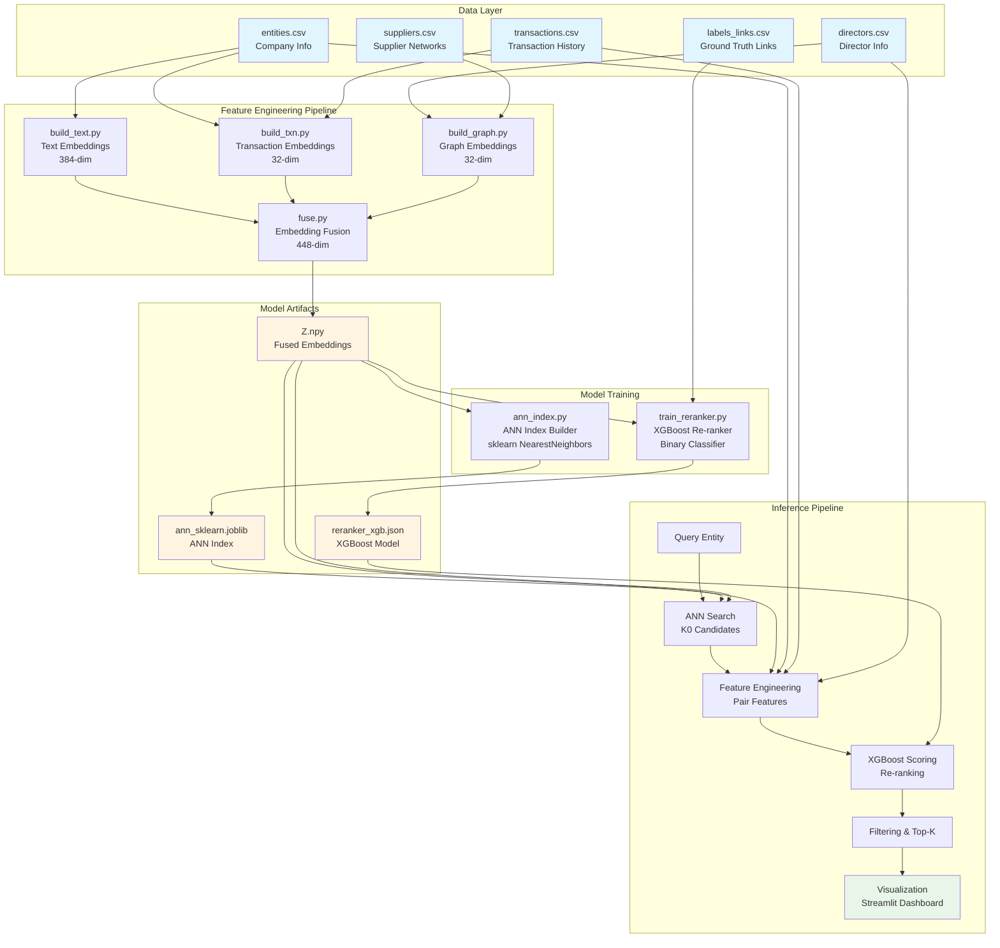
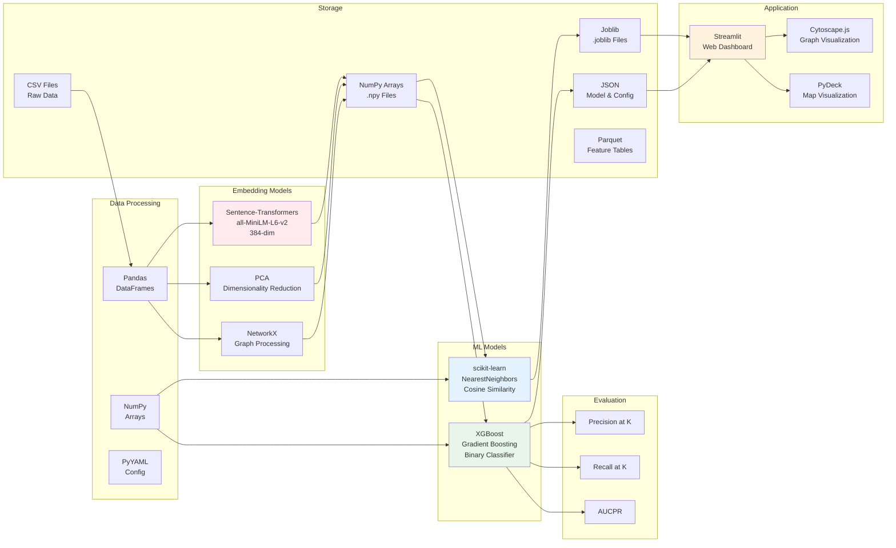
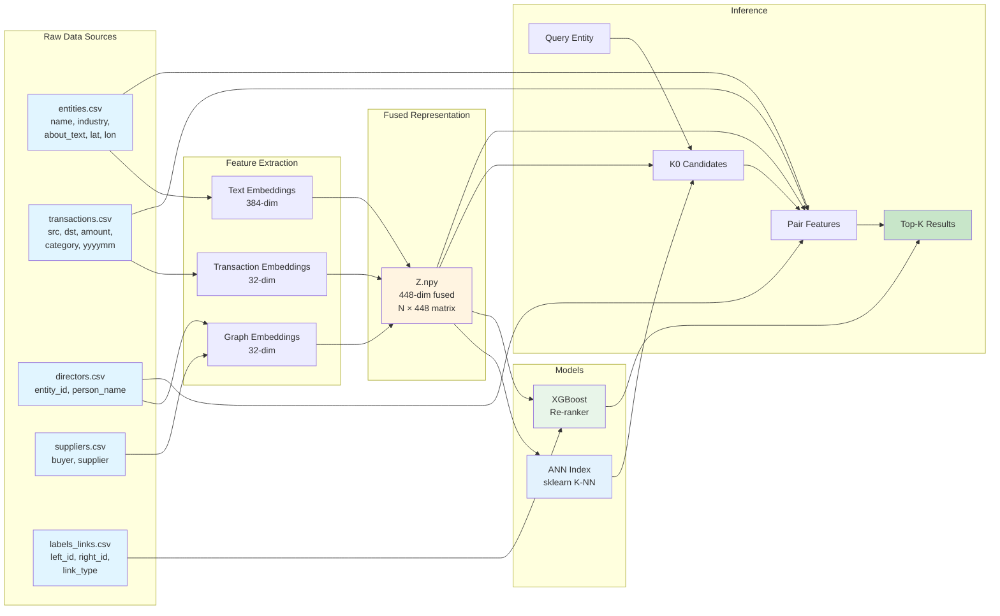
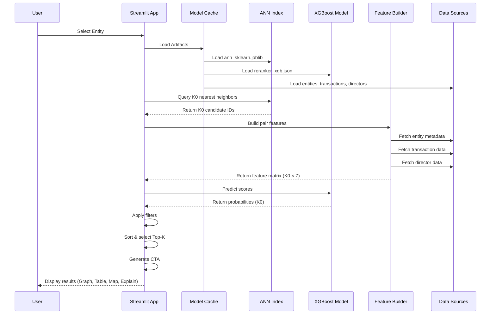
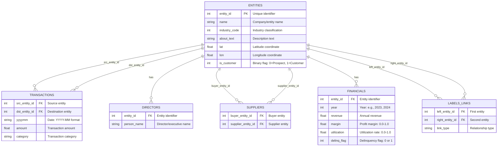
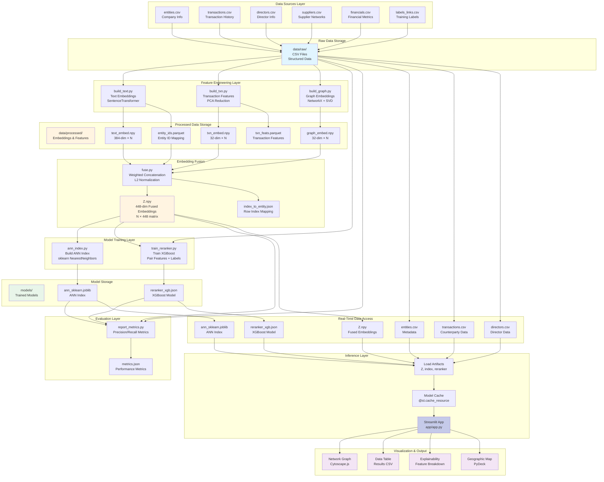

# Proximity Finder - Architecture Diagrams

This document contains high-level architecture, tech stack, and flow diagrams for the Proximity Finder system.

---

## 1. High-Level Architecture



---

## 2. Tech Stack



---

## 3. Training Flow


---

## 4. Inference Flow


---

## 5. Data Flow Diagram



---

## 6. Component Interaction Diagram



---

## 7. Data Model Design



### Data Model Description

#### Core Entity: `ENTITIES`
The central table containing all company/entity information. Each entity represents a business organization (corporate or SME) in the system.

**Key Attributes:**
- `entity_id`: Primary key, unique identifier for each entity
- `name`: Company name
- `industry_code`: Industry classification code (used for industry matching)
- `about_text`: Descriptive text about the entity (used for text embeddings)
- `lat`, `lon`: Geographic coordinates (used for distance calculations)
- `is_customer`: Binary flag indicating customer status (ETB vs NTB)

#### Transaction History: `TRANSACTIONS`
Records all transactions between entities, capturing business relationships and transaction patterns.

**Key Attributes:**
- `src_entity_id`: Foreign key to source entity
- `dst_entity_id`: Foreign key to destination entity
- `yyyymm`: Transaction date in YYYY-MM format
- `amount`: Transaction amount
- `category`: Transaction category (e.g., "raw_materials", "utilities", "services", "retail_pos", "logistics")

**Usage:**
- Used to compute counterparty overlap (Jaccard similarity)
- Transaction patterns used for behavior-based embeddings
- Seasonality features extracted from monthly patterns

#### Directors: `DIRECTORS`
Associates directors/executives with entities, enabling detection of shared ownership/control relationships.

**Key Attributes:**
- `entity_id`: Foreign key to entity
- `person_name`: Director/executive name

**Usage:**
- Detects director overlap between entities (indicator of common ownership)
- Used in graph embeddings to build relationship networks
- Feature: `director_overlap` = count of shared directors

#### Supplier Relationships: `SUPPLIERS`
Represents supplier-buyer relationships, forming a directed graph of business supply chains.

**Key Attributes:**
- `buyer_entity_id`: Foreign key to buyer entity
- `supplier_entity_id`: Foreign key to supplier entity

**Usage:**
- Builds graph structure for graph embeddings
- Reveals supply chain connections and business ecosystems
- Entities with similar supplier networks are likely related

#### Financial Metrics: `FINANCIALS`
Annual financial performance data per entity.

**Key Attributes:**
- `entity_id`: Foreign key to entity
- `year`: Year of financial data
- `revenue`: Annual revenue
- `margin`: Profit margin (0.0 to 1.0)
- `utilization`: Utilization rate (0.0 to 1.0)
- `delinq_flag`: Delinquency flag (0 or 1)

**Usage:**
- Currently stored but not actively used in current model
- Potential for future feature engineering (financial similarity)

#### Training Labels: `LABELS_LINKS`
Ground truth relationship labels used for supervised training of the re-ranker model.

**Key Attributes:**
- `left_entity_id`: Foreign key to first entity
- `right_entity_id`: Foreign key to second entity
- `link_type`: Relationship type (e.g., "supplier_of", "common_owner", "co_customer")

**Usage:**
- Defines positive examples for XGBoost re-ranker training
- Model automatically samples negative pairs (random non-linked entities)
- Only required during training phase, not needed for inference

### Relationship Cardinalities

- **ENTITIES → TRANSACTIONS**: One-to-many (one entity can have many transactions as source or destination)
- **ENTITIES → DIRECTORS**: One-to-many (one entity can have multiple directors)
- **ENTITIES → SUPPLIERS**: One-to-many (one entity can be buyer or supplier in multiple relationships)
- **ENTITIES → FINANCIALS**: One-to-many (one entity can have financial data for multiple years)
- **ENTITIES → LABELS_LINKS**: One-to-many (one entity can be in multiple labeled relationships)

### Data Integrity Rules

1. **Foreign Key Constraints**: All foreign keys must reference existing `entity_id` values in `ENTITIES`
2. **Entity ID Consistency**: `entity_id` values must be unique and consistent across all files
3. **Geographic Coordinates**: `lat` should be between -90 and 90, `lon` between -180 and 180
4. **Date Format**: `yyyymm` must be in "YYYY-MM" format (e.g., "2024-03")
5. **Numeric Ranges**: `margin` and `utilization` should be between 0.0 and 1.0
6. **Binary Flags**: `is_customer` and `delinq_flag` must be 0 or 1

### Data Flow in Model Pipeline

1. **Text Embeddings**: Uses `entities.about_text` + `entities.industry_code`
2. **Transaction Embeddings**: Uses `transactions` table to compute behavior patterns
3. **Graph Embeddings**: Uses `directors` and `suppliers` tables to build relationship graphs
4. **Feature Engineering**: Combines data from all tables to compute pair features:
   - Cosine similarity (from embeddings)
   - Jaccard counterparty overlap (from `transactions`)
   - Geographic distance (from `entities.lat`, `entities.lon`)
   - Industry match (from `entities.industry_code`)
   - Director overlap (from `directors`)
5. **Training**: Uses `labels_links` to train supervised re-ranker

---

## 8. Data Architecture



### Data Architecture Layers

#### 1. Data Sources Layer
**Purpose**: Raw input data from external sources or data pipelines

**Components**:
- **entities.csv**: Core company information (name, industry, location, customer status)
- **transactions.csv**: Historical transaction records between entities
- **directors.csv**: Director/executive associations with entities
- **suppliers.csv**: Supplier-buyer relationship network
- **financials.csv**: Annual financial performance metrics
- **labels_links.csv**: Ground truth relationship labels for training

**Characteristics**:
- CSV format for easy ingestion
- Structured, tabular data
- Can be updated incrementally
- Source of truth for entity metadata

#### 2. Raw Data Storage
**Location**: `data/raw/`

**Purpose**: Centralized storage for all raw input files

**Characteristics**:
- File-based storage (CSV format)
- No transformation applied
- Version-controlled or timestamped
- Serves as data lake for feature engineering

#### 3. Feature Engineering Layer
**Purpose**: Transform raw data into numerical embeddings and features

**Components**:
- **build_text.py**: Generates 384-dim text embeddings using SentenceTransformer
- **build_txn.py**: Extracts transaction patterns and reduces to 32-dim via PCA
- **build_graph.py**: Builds graph structure and generates 32-dim graph embeddings via SVD

**Processing**:
- Batch processing (runs on full dataset)
- Stateless transformations
- Reproducible (deterministic outputs)
- Can be re-run when source data changes

#### 4. Processed Data Storage
**Location**: `data/processed/`

**Purpose**: Store intermediate embeddings and features

**Components**:
- **text_embed.npy**: Text embeddings (384-dim × N entities)
- **txn_embed.npy**: Transaction embeddings (32-dim × N entities)
- **graph_embed.npy**: Graph embeddings (32-dim × N entities)
- **txn_feats.parquet**: Raw transaction features (before PCA)
- **entity_ids.parquet**: Entity ID ordering for alignment

**Characteristics**:
- NumPy arrays for fast numerical operations
- Parquet for structured feature tables
- Optimized for ML pipeline consumption
- Can be cached for faster access

#### 5. Embedding Fusion
**Purpose**: Combine multi-modal embeddings into unified representation

**Process**:
1. Load individual embeddings (text, txn, graph)
2. L2 normalize each embedding type
3. Apply configurable weights
4. Concatenate into single 448-dim vector
5. Save fused embedding matrix Z.npy

**Outputs**:
- **Z.npy**: Fused embeddings (448-dim × N entities)
- **index_to_entity.json**: Mapping between matrix row index and entity_id

**Characteristics**:
- Single source of truth for entity representations
- Used for ANN search
- Normalized for cosine similarity computation

#### 6. Model Training Layer
**Purpose**: Train ML models for inference

**Components**:
- **ann_index.py**: Builds sklearn NearestNeighbors index on Z.npy
- **train_reranker.py**: Trains XGBoost classifier on pair features

**Inputs**:
- Fused embeddings (Z.npy)
- Training labels (labels_links.csv)
- Entity metadata (for feature engineering)

**Outputs**:
- ANN index (for fast candidate retrieval)
- XGBoost model (for re-ranking)

#### 7. Model Storage
**Location**: `models/`

**Purpose**: Store trained models for inference

**Components**:
- **ann_sklearn.joblib**: Serialized NearestNeighbors index
- **reranker_xgb.json**: XGBoost model in JSON format

**Characteristics**:
- Version-controlled (can timestamp models)
- Portable (JSON format for XGBoost)
- Loaded once and cached in memory
- Can be swapped for A/B testing

#### 8. Evaluation Layer
**Purpose**: Assess model performance

**Process**:
- Load test queries from labels_links.csv
- Run inference pipeline
- Compute Precision@K and Recall@K
- Save metrics to JSON

**Output**: `metrics.json` with performance statistics

#### 9. Inference Layer
**Purpose**: Real-time query processing

**Components**:
- **Streamlit App**: Web interface for user queries
- **Model Cache**: Caches loaded models using `@st.cache_resource`
- **Load Artifacts**: Loads all required data and models

**Data Access**:
- Reads from processed data storage (Z.npy)
- Reads from model storage (joblib, JSON)
- Reads from raw data (CSV) for metadata

**Characteristics**:
- Lazy loading (loads on first query)
- Cached for subsequent queries
- Sub-second latency
- Handles concurrent users

#### 10. Real-Time Data Access
**Purpose**: Fast access to data during inference

**Components**:
- Fused embeddings (Z.npy) - loaded into memory
- ANN index (joblib) - loaded into memory
- XGBoost model (JSON) - loaded into memory
- Entity metadata (CSV) - loaded into Pandas DataFrame
- Transaction data (CSV) - loaded for feature computation
- Director data (CSV) - loaded for feature computation

**Optimization**:
- Models cached in memory (no disk I/O during inference)
- DataFrames loaded once per session
- Vectorized operations for speed

#### 11. Visualization & Output
**Purpose**: Present results to end users

**Components**:
- **Network Graph**: Interactive graph visualization (Cytoscape.js)
- **Data Table**: Tabular results with download (CSV export)
- **Explainability**: Feature-level explanations
- **Geographic Map**: Location-based visualization (PyDeck)

### Data Flow Patterns

#### Training Flow (Batch)
```
Raw Data → Feature Engineering → Processed Storage → Fusion → Model Training → Model Storage
```

#### Inference Flow (Real-Time)
```
User Query → Load Artifacts (cached) → ANN Search → Feature Engineering → Re-ranking → Visualization
```

#### Data Update Flow
```
New Data → Raw Storage → Re-run Feature Engineering → Re-run Fusion → Re-train Models → Update Model Storage
```

### Storage Characteristics

| Layer | Format | Size (10K entities) | Access Pattern | Update Frequency |
|-------|--------|---------------------|-----------------|-------------------|
| Raw Data | CSV | ~10-50 MB | Sequential read | Daily/Weekly |
| Processed | NumPy/Parquet | ~50-100 MB | Random access | On data update |
| Fused Embeddings | NumPy | ~20 MB | Random access | On data update |
| Models | Joblib/JSON | ~5-20 MB | Load once | On retrain |
| Metrics | JSON | <1 KB | Read-only | On evaluation |

### Data Lineage

1. **entities.csv** → text_embed.npy → Z.npy → ANN index
2. **transactions.csv** → txn_embed.npy → Z.npy → ANN index
3. **directors.csv + suppliers.csv** → graph_embed.npy → Z.npy → ANN index
4. **Z.npy + labels_links.csv** → Pair features → XGBoost model
5. **All sources** → Feature engineering → Inference pipeline → Results

### Scalability Considerations

- **Horizontal Scaling**: Feature engineering can be parallelized across entities
- **Caching Strategy**: Models cached in memory to avoid repeated disk I/O
- **Incremental Updates**: Can update embeddings for new entities without full rebuild
- **Storage Optimization**: NumPy arrays use efficient binary format
- **Memory Management**: Large datasets can be processed in batches

---

## Summary

### Architecture Highlights

1. **Two-Stage Pipeline**: Fast ANN retrieval + accurate supervised re-ranking
2. **Multi-Modal Embeddings**: Text, transaction, and graph signals combined
3. **Feature-Rich Re-ranking**: 7 engineered features capture relationship signals
4. **Real-Time Inference**: Sub-second latency for interactive queries
5. **Explainable Results**: Feature-level explanations and CTA recommendations

### Key Technologies

- **Embeddings**: Sentence-Transformers (HuggingFace)
- **ANN Search**: scikit-learn NearestNeighbors
- **Re-ranking**: XGBoost Gradient Boosting
- **Visualization**: Streamlit + Cytoscape.js + PyDeck
- **Data Processing**: Pandas, NumPy, NetworkX

### Performance Characteristics

- **Training Time**: 5-10 min (10K entities), 30-45 min (100K entities)
- **Inference Time**: 70-160 ms per query
- **Scalability**: Handles 10K-100K entities efficiently
- **Accuracy**: Precision@20 ≈ 0.78, Recall@20 ≈ 0.45

